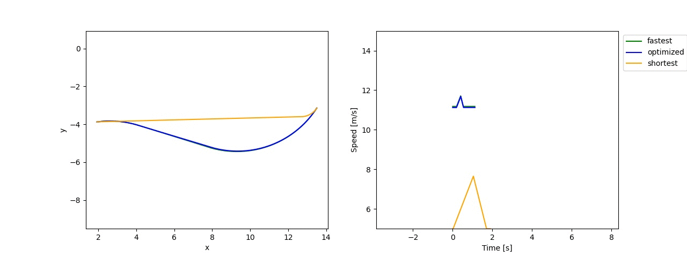
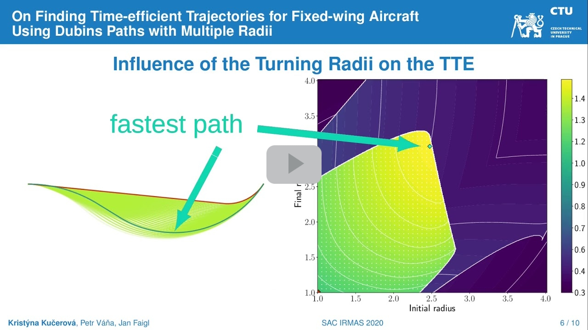

# Accelerated Dubins Julia Library

This library is used for computing multi-radius Dubins path. The radii of first and last segments can be changed independently, which allows to increase the vehicle's speed. This can decrease total travel time when the turning radii are selected right.

Full description is provided in the following [paper](https://dl.acm.org/doi/10.1145/3341105.3374112).
```
@inproceedings{kucerova2020finding,
  title     = {On finding time-efficient trajectories for fixed-wing aircraft using dubins paths with multiple radii},
  author    = {Ku{\v{c}}erov{\'a}, Krist{\'y}na and V{\'a}{\v{n}}a, Petr and Faigl, Jan},
  booktitle = {Proceedings of the 35th Annual ACM Symposium on Applied Computing},
  pages     = {829--831},
  year      = {2020}
} 
```

## Instalation
For Julia, it is necessary to have the `Optim` library installed.

To use the `example.jl`, The `PyPlot`, `PyCall` Julia libraries and Python library `matplotlib` are required.

The package can be installed in Julia by following commands.
``` julia
using Pkg
Pkg.add(PackageSpec(url="https://github.com/comrob/AcceleratedDubins.jl"))
```

## Paths example


Shortest is original Dubins. The two other trajectories are proposed paper, where the "fastest" is found using multiple radii samples and the "optimized" uses local optimization.
## Basic usage
See example/basic.jl
```julia
using AcceleratedDubins

## Parameters of the vehicle
params = [5., 15., 2.6, 4] ## v_min v_max a_max -a_min
r_min = 1. # minimum turning radius
r_max = 5. # maximum turning radius

## Generate random configurations
start = [10*rand(), -10+5*rand(), 2*pi*rand()]
stop = [10+20*rand(), -10+5*rand(), 2*pi*rand()]

## try radii combinations and get resulting path time
    path_fastest, _ = fastest_path(start, stop, radii_samples_exp(r_min, r_max, 3), params)
    time_fastest = path_time(path_fastest, params)
## try to optimize path using Optim
    path_optimized, _ = optimized_path(start, stop, [r_min, r_max], params)
    time_optimized = path_time(path_optimized, params)
## compute shortest path (original Dubins with r_min)
    path_shortest, _ = retrieve_path(start, stop, [r_min, r_min], params)
    time_shortest = path_time(path_shortest, params)

@show time_fastest, time_optimized, time_shortest

## sample the path for plotting 
times, speeds = speed_profile(path_fastest, params)

```

## Youtube presentation
[](https://youtu.be/6yB5sgBQ9og)

## Path computation functions
- `fastest_path`: Selects fastest path using the radii combinations of input array.
- `optimized_path`: Selects fastest path from local optimization. Performs two optimizations with different initializations to avoid bad local minimum.
- `retrieve_path`: Selects from maneuvers the best path for starting and ending radii.

## Helper functions
- `path_len`: Returns length of the input path.
- `path_time`: Computes the speed profule and gets the path time.
- `speed_by_radius`: Returns the maximum value for given radius.

## Sampling functions
- `sample_path`: Returns x and y coordinates to plot the path.
- `speed_profile`: Returns time and speed coordinates to plot the speed profile.

*problems or suggestions email to [kucerkr1@fel.cvut.cz](mailto:kucerkr1@fel.cvut.cz)*
